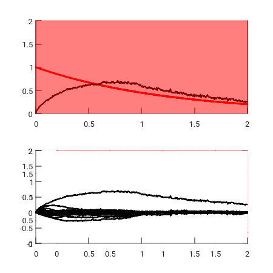
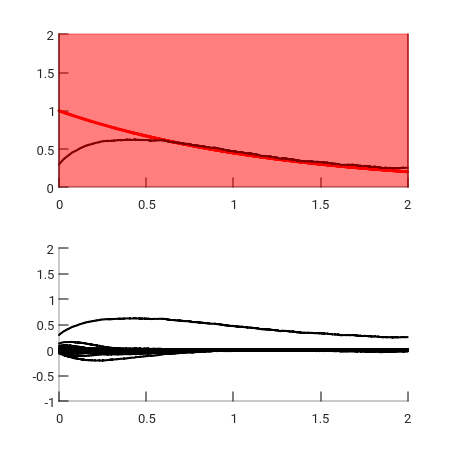
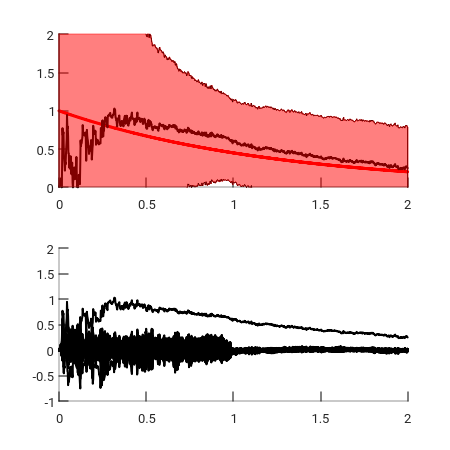
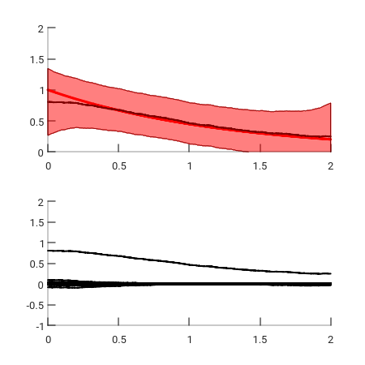

## Motivation
This is an attempt to reproduce some results presented in
[Bayesian Spectrum Estimation of Unevenly Sampled Nonstationary Data](https://affect.media.mit.edu/pdfs/02.qi-minka-picard.pdf)
by Qi et al.

They attacked the problem of spectral estimation.
Traditional methods assume stationarity and uniform spacing
between samples of data.
To overcome those limitations, Qi et al.
used a non-stationary Kalman filter
to jointly estimate all spectral coefficients instantaneously.

## Dependencies
The Matlab code was tested on Octave 4.2.2 and ought to work fine with
any non-ancient Matlab / Octave version.

## Code
User inputs:

* `sigtrue`: This is the standard error of the true observation noise.
* `dt`: The specifies the time interval between two observations.
We assume that the observations were evenly sampled, but the technique
can handle unevenly sampled data.
* `t`: It is the times at which the data were sampled.
* `f_true`: The frequency of the observations.
* `f`: An array storing the frequency bands.
* `beta`: This parameter controls how fast the amplitude of the signal varies.

The priors can be modified:

* `z`: This scales the process noise (default: `z=1000`).
* `m0` and `v0`: Those are the mean and variance of the initial state respectively.
The mean is supposed to be zero, and the variance to be diagonal (default: diagonal
elements are equal to 100).

`kfiltering` calls the Kalman filter and `ksmoothing` calls the Kalman smoother.
The Kalman smoother requires the results from the Kalman filter.

## Test

How to use the code is best illustrated in the test file `test_sine_125.m` whose results are presented in the next section.

## Results
We synthesize an evenly sampled signal that contains one 125Hz sinusoid wave modulated
with an exponentially fast decaying amplitude.
We test all frequencies from 1Hz to 125Hz. The signal is plotted over T=[0:2]
with a discretization dt=0.002 (it must be smaller than 0.004, the inverse gives the Nyquist sampling rate).
All parameters are set to their defaults if not explicitly specified, in particular `z=1000`.

<table>
  <tr>
    <td></td>
    <td></td>
  </tr>
  <tr>
    <td align="center">Kalman filtering.</td>
    <td align="center">Kalman smoothing.</td>
  </tr>
  <tr>
    <td colspan="2">Evenly sampled noisy (std 0.1) signal that contains one 125Hz sinusoid wave modulated with an exponentially fast decaying amplitude, `z=1000`; in the first row  the true amplitude of the signal is shown in red whereas the predictive mean for the amplitude at 125Hz is shown in black; in the second row, all amplitudes are plotted.  </td>
  </tr>
</table>

The variance (filled area in red in the previous figure) is huge and so useless. This is to be ascribed to the large value of `z`.
A large value means that the amplitude of the frequencies can change a lot from one time-step to the next. Even if the
decay is exponential, this does not hold. The figure below shows much better predictive results with `z=1`.

<table>
  <tr>
    <td></td>
    <td></td>
  </tr>
  <tr>
    <td align="center">Kalman filtering.</td>
    <td align="center">Kalman smoothing.</td>
  </tr>
  <tr>
    <td colspan="2">Evenly sampled noisy (std 0.1) signal that contains one 125Hz sinusoid wave modulated with an exponentially fast decaying amplitude, `z=1`; in the first row  the true amplitude of the signal is shown in red whereas the predictive mean for the amplitude at 125Hz is shown in black; in the second row, all amplitudes are plotted.</td>
  </tr>
</table>

## Future work
* It is assumed that the signal is composed of only a few number of frequencies.
The model has no built-in device to induce sparsity. We will set a spike and slab prior
on the state. This is a natural way to express a prior belief that most
frequencies are exactly zero.
* The treatment could be done using variational Bayesian methods as in
[Unified Inference for Variational Bayesian Linear Gaussian State-Space Models](https://papers.nips.cc/paper/3023-unified-inference-for-variational-bayesian-linear-gaussian-state-space-models.pdf)
by Barber and Chiappa.

## Authors
Laurent de Vito

## License
All third-party libraries are subject to their own license.

 This work is licensed under a <a rel="license" href="http://creativecommons.org/licenses/by-nc-nd/4.0/">Creative Commons Attribution-NonCommercial-NoDerivatives 4.0 International License</a>.
