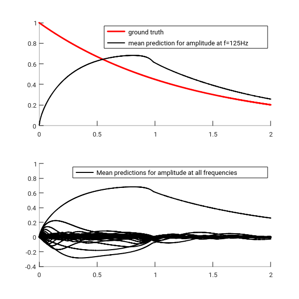
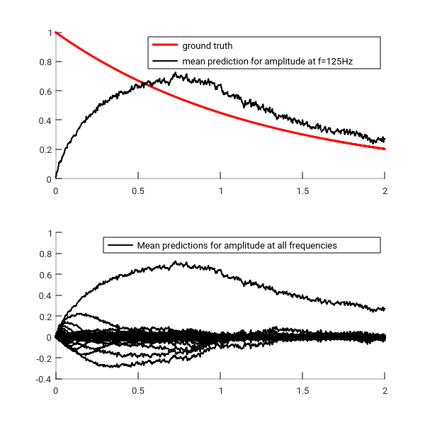

# Bayesian Spectral Estimation

## Motivation
This is an attempt to reproduce some results presented in 
[Bayesian Spectrum Estimation of Unevenly Sampled Nonstationary Data](https://affect.media.mit.edu/pdfs/02.qi-minka-picard.pdf)
by Qi et al.

They attacked the problem of spectral estimation. 
Traditional methods assume stationarity and uniform spacing
between samples of data.
To overcome those limitations, Qi et al.
used a non-stationary Kalman filter
to jointly estimate all spectral coefficients instantaneously.

## Dependencies
The Matlab code was tested on Octave 4.2.2 and ought to work fine with
any non-ancient Matlab / Octave version.

## Code
User inputs:

* `sigtrue`: This is the standard error of the true observation noise.
* `dt`: The specifies the time interval between two observations.
We assume that the observations were evenly sampled, but the technique
can handle unevenly sampled data.
* `t`: It is the times at which the data were sampled.
* `f_true`: The frequency of the observations.
* `f`: An array storing the frequency bands.
* `beta`: This parameter controls how fast the amplitude of the signal varies.

The user can modify the priors:

* `z`: This scales the process noise (default: `z=1000`).
* `m0` and `v0`: Those are the mean and variance of the initial state respectively.
The mean is supposed to be zero, and the variance to be diagonal (default: diagonal
elements are equal to 100).

## Results
We synthesize a evenly sampled signal that contains one 125Hz sinusoid wave modulated
with an exponentially fast decaying amplitude.
We test all frequencies from 1Hz to 125Hz. The signal is plotted over T=[0:2]
with a discretization dt=0.002 (it must be smaller than 0.004, the inverse gives the Nyquist sampling rate).
All parameters are set to their defaults otherwise.

Without any observation noise, we get:

 
Evenly sampled signal that contains one 125Hz sinusoid wave modulated with an exponentially fast decaying amplitude - No observation noise.

With observation noise with standard deviation of 0.1, we get:

 
Evenly sampled signal that contains one 125Hz sinusoid wave modulated with an exponentially fast decaying amplitude - Observation of 0.1 (std deviation).

## Future work
* Implement the Kalman smoothing.
* It is assumed that the signals is composed of only a few number of frequencies.
The model has no built-in device to induce sparsity. We will set a spike and slab prior
on the state. This is a natural way to express a prior belief that most
frequencies are exactly zero.